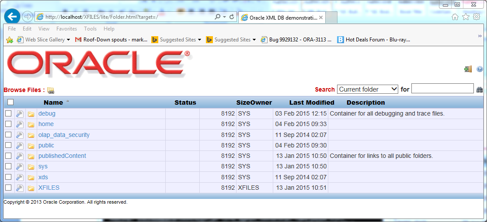

Executive Overview
==================

The JSON INTRODUCTION example is a browser based demonstration that provides a brief overview of how to store, index, query and update JSON content stored in Oracle Database 12c. 

Installation Instructions
=========================

Installation is supported for database 12.1.0.2.0. The example can be installed in conjunction with the Oracle Multitenant option, but example must be installed into a Pluggable Database (PDB).

Pre-requisites
--------------

-   The XFILES application must be installed prior to installing the example code.

-   Interactive installation is only supported under MS-Windows. Script based installation is available for other environments. The target database can be running on any platform as long as that database can be accessed via SQL\*NET.

-   For Interactive installations, the installation directory must be a local drive on the installation machine. The use of network or mapped drives can lead to ‘cross-site’ scripting exceptions being reported by the installation process.

-   SQL\*PLUS must be installed on the machine that is being used to perform the installation.

-   Credentials are required for two users. The first is a user how has been granted the DBA role. The second is the user who will be used to run the example code. In a multitenant environment these must exist in the PDB that hosts the XFILES application.

Verify that the XFILES application is installed correctly.
----------------------------------------------------------

Use a browser to verify that the XFILES application has been installed correctly. Start a browser on the installation machine and enter the following URL: HTTP://hostname:port/XFILES. Hostname should be the ip-address of the machine hosting the Oracle Database and port should be the port number allocated to the database’s native HTTP Server. If everything is installed and configured correctly the database should respond with an HTTP page similar to the one shown below.

Click the “Login Icon”[ ]. The browser will request HTTP authentication.

Confirm that the user that will be used to run the example code can login to the XFILES applicaiton. Note that the username and password are both case sensitive, and that a database user name is typically uppercase (unless the user was created using as a quoted identifier). If the user cannot login to XFILES ensure that they have been granted XFILES\_USER role.

Download and extract the Installation media
-----------------------------------------------------------------------------------------------------------------------------------------

Download the latest version of the application from GitHub. The application can be found [here](https://github.com/oracle/json-in-db).

Use the Download Zip button to download the contents of the GitHub repository. The Zip file will be called json-in-db-master.zip.

Windows Installation
==================================================================================================================

Unzip the archive. This will create a folder called json-in-db-master with a subfolder INTRODUCTION.

Locate the Install Folder
-------------------------

The install folder is a sub-folder of the INTRODUCTION folder.

Set correct permissions on the installer files.
-----------------------------------------------

The install folder contains the files needed to perform the installation. The install is performed using a HTML Application file (**install.hta**) which invokes a VBScript (**install.vbs**). In some cases windows may block these files from accessing remote resources. This can prevent the installation from running successfully against a remote database. To ensure that the **install.hta**, and **install.vbs** files are not blocked, right click on each file and select properties

If the General Tab of the properties dialog of either file contains an “unblock” button, click it to allow the file to execute normally.

Launch the Installer
--------------------

Launch the Installer by typing install.hta at a command prompt or clicking on the install.hta icon. The exact path to the “install” folder will depend on which example is being installed and which directory was the target for the unzip operation.

Perform the Installation
----------------------------------------------------------------------------------------------------------------------

The installer application provides a simple GUI interface that is used to supply parameters to the installation process.

Select the correct Oracle Home for the SQL\*PLUS installation. Make sure that all fields contain the appropriate values for your environment, enter the required passwords and click install. The field DBA User must be set to a user who has been granted permissions to connect normally and as DBA. If you are not sure of the correct values for HTTP and FTP port numbers these can be automatically detected using the the “Load Ports” button. The system will report when the installation is complete.

The results of the installation can be found in the INTRODUCTION.log file.

Linux Installation
==================

A simple install script is provided to allow the example to be installed from a Linux command shell. Unzip the archive generated by GitHub

The demonstration is installed using the INTRODUCTION.sh script found in the folder json-in-db-master/INTRODUCTION/install.

To run the installation script first set the current directory to the install directory. Make sure that the environment variables ORACLE\_HOME and ORACLE\_SID are set correctly.Invoke the INTRODUCTION.sh script passing the following arguments on the command line

DBA User. This must be a DBA

The password for the DBA user

The username that will be used to run the example

The password for the user

The URL of the Database’s HTTP Listener.

Verify the Installation was successful
======================================

Once the script has completed check the INTRODUCTION.log file for any errors. If there are no errors in the log file verify that the installation completed successfully by opening a browser and navigating to the following URL http://hostname:port/XFILES. Login as the user specified during the installation procedure and click on the “Home” button [].

This will display the user’s home folder

If the demonstration was installed successfully, the home folder contains a folder called “demonstrations” which inturn contains a folder called “JSON” which contains a folder called “introduction”.

Navigate to the “introduction” folder and click the index.html file. This should open a new browser tab or window, ready to run the first step of the example.

