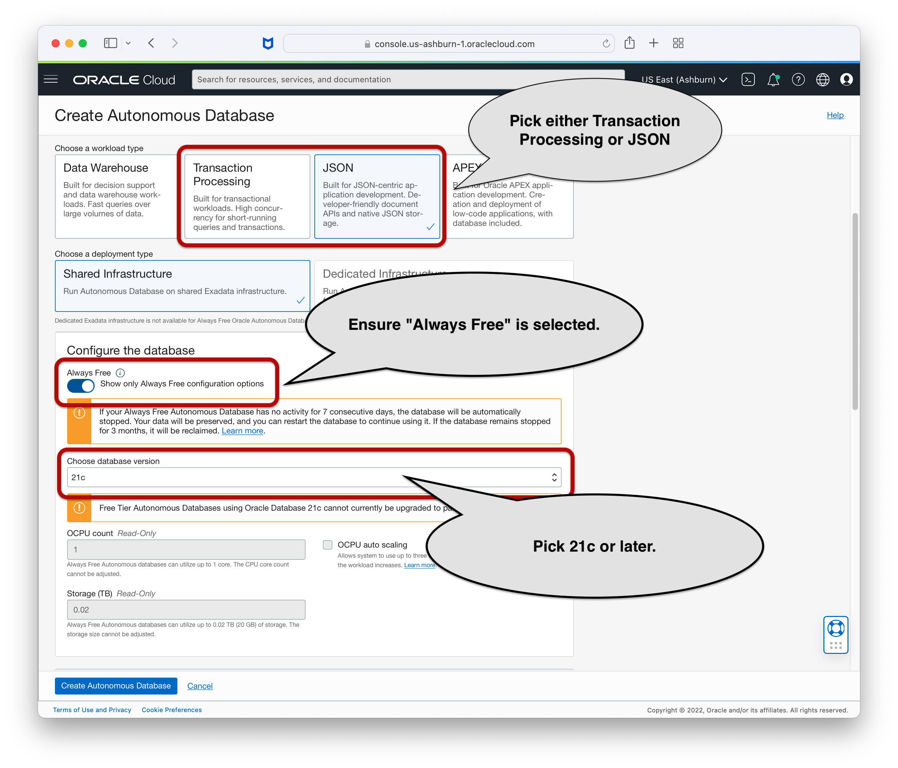

# JDBC and JSON in Oracle Database 21c+ 

This directory contains examples of how to store and access JSON type values in Oracle Database from a Java program. 

  * [emp.CreateTable](src/main/java/emp/CreateTable.java) - Creates the employee table `emp` used by all the examples.
  * [emp.Insert](src/main/java/emp/Insert.java) - Inserts three JSON values into the `emp` table.
  * [emp.GetAll](src/main/java/emp/GetAll.java) - Gets all the JSON values from the `emp` table.
  * [emp.Filter](src/main/java/emp/Filter.java) - Selects employees from the `emp` table where the salary attribute is greater than 30,000.
  * [emp.Filter2](src/main/java/emp/Filter2.java) - Selects employees from the `emp` table that have the `created` attribute.
  * [emp.Update](src/main/java/emp/Update.java) - Updates an employee record using whole document replacement.
  * [emp.UpdateMerge](src/main/java/emp/UpdateMerge.java) - Performs a partial update using JSON_MERGEPATCH().
  * [emp.UpdateTransform](src/main/java/emp/UpdateTransform.java) - Performs a partial update using JSON_TRANSFORM().
  * [emp.JSONP](src/main/java/emp/JSONP.java) - Inserts and retrieves a value using [JSON-P (javax.json)](https://javaee.github.io/jsonp/) interfaces.
  * [emp.JSONB](src/main/java/emp/JSONB.java) - Stores and retrieves a plain/custom Java object as JSON using [JSON-B (javax.json.bind)](https://javaee.github.io/jsonb-spec/).
  * [emp.Jackson](src/main/java/emp/Jackson.java) - Encodes JSON from an external source, in this case a Jackson parser, as Oracle binary JSON and inserts it into the table.
  * [emp.BinaryJson](src/main/java/emp/BinaryJson.java) - Encodes JSON text as Oracle binary JSON, stores it in a file, and then reads it back again.
  * [emp.RunAll](src/main/java/emp/RunAll.java) - Runs all the examples at once.
  * [emp.DropTable](src/main/java/emp/DropTable.java) - Drops the table used by the examples.

See also:
  * Documentation: [The API for JSON type in Oracle Database (oracle.sql.json)](https://javadoc.io/static/com.oracle.database.jdbc/ojdbc8/21.4.0.0/oracle/sql/json/package-summary.html#package.description)
  * Video (YouTube): [AskTom Office Hours: The Java API for JSON type in Oracle JDBC](https://youtu.be/jg5d15-2K3Y)

Need help, talk to us on Slack:
  * Join oracledevrel: https://join.slack.com/t/oracledevrel/shared_invite/zt-1h0fhz7f8-gHM298rFasYzlTn0Nii2sQ
  * Channel: #oracle-db-json

## Running the examples

### Create a database

These steps show how to create an always-free Autonomous Database but any 21c or later version of Oracle Database will also work.

1. Create a free cloud account:<br/>
   [https://www.oracle.com/cloud/free/](https://www.oracle.com/cloud/free/). 
   
   _It will ask for a credit card for identification purposes.  Your card will not be charged unless you manually choose to upgrade out of the free-tier limits._
   
2. Sign-in to the cloud console and click on **Autonomous JSON Database** under **Oracle Database**. <br/>
    

3. Click **Create Autonomous Database**.  When creating the database, ensure that
    - Workload type **Transaction Processing** or **JSON** is selected
    - **Always Free** is selected
    - Version **21c** (or later) is selected
    - **IMPORTANT**: 21c is required to run these examples.  At the time of this writing, Autonomous 21c is only available in the Always Free Tier and is restricted to the regions (IAD - US East, PHX - US West, LHR - UK South, and FRA - Germany Central).  If 21c is not available in your Cloud region, you can alternatively use [Oracle Database XE](https://www.oracle.com/database/technologies/xe-downloads.html) to run the database locally.

    

    - Select "Secure access from allowed IPs and VCNs only" and add your current IP address. This makes it so access is only allowed from your current IP address.  It also makes it so that Mutual TLS encryption is not required (you don't have to download the database wallet). 
    

4. Once the database is created, click on **DB Connection**

    <kbd></kbd>

   Select TLS and copy the connection string by clicking "Copy".  Use "tp" for transactional or operational workloads.

    <kbd></kbd>

### Setup the examples

1. Clone these examples from github.  For example:
    ```
    git clone https://github.com/oracle/json-in-db.git
    cd json-in-db/JdbcExamples/
    ```
    If you don't have `git` you can alternatively download them here:
    [https://github.com/oracle/json-in-db/archive/master.zip](https://github.com/oracle/json-in-db/archive/master.zip)
   
2. Install [Java](https://www.oracle.com/java/technologies/javase-downloads.html#JDK8) and [Maven](https://maven.apache.org/install.html)

3. Build the examples:

    ```
    mvn package
    ``` 

### Run the examples

1. Run all the examples:

    ```
     mvn -q exec:java \
      -Dexec.mainClass="emp.RunAll" \
      -Dexec.args='jdbc:oracle:thin:ADMIN/[PASSWORD]@[CONNECTION STRING]'
    ```
    But replace the following values with your own:
    - Replace [PASSWORD] with the ``ADMIN`` password you specified when you created the database
    - Replace [CONNECTION STRING] with the string you copied above in step 4.

    The actual command might look something like this:

    ```
     mvn -q exec:java \
      -Dexec.mainClass="emp.RunAll" \
      -Dexec.args='jdbc:oracle:thin:ADMIN/SecurePassword123!@(description=(retry_count=20)(retry_delay=3)(address=(protocol=tcps)(port=1521)(host=adb.us-ashburn-1.oraclecloud.com))(connect_data=(service_name=tx8s4whxjz2u232_demo_tp.adb.oraclecloud.com))(security=(ssl_server_dn_match=yes)(ssl_server_cert_dn="CN=adwc.uscom-east-1.oraclecloud.com, OU=Oracle BMCS US, O=Oracle Corporation, L=Redwood City, ST=California, C=US")))'
    ```

2. Drop the table used by the examples:

    ```
     mvn -q exec:java \
      -Dexec.mainClass="emp.DropTable" \
      -Dexec.args='jdbc:oracle:thin:ADMIN/SecurePassword123!@(description=(retry_count=20)(retry_delay=3)(address=(protocol=tcps)(port=1521)(host=adb.us-ashburn-1.oraclecloud.com))(connect_data=(service_name=tx8s4whxjz2u232_demo_tp.adb.oraclecloud.com))(security=(ssl_server_dn_match=yes)(ssl_server_cert_dn="CN=adwc.uscom-east-1.oraclecloud.com, OU=Oracle BMCS US, O=Oracle Corporation, L=Redwood City, ST=California, C=US")))'

    ```

3. You can also run specific examples, one at a time:

    ```
     mvn -q exec:java \
      -Dexec.mainClass="emp.CreateTable" \
      -Dexec.args='jdbc:oracle:thin:ADMIN/SecurePassword123!@(description=(retry_count=20)(retry_delay=3)(address=(protocol=tcps)(port=1521)(host=adb.us-ashburn-1.oraclecloud.com))(connect_data=(service_name=tx8s4whxjz2u232_demo_tp.adb.oraclecloud.com))(security=(ssl_server_dn_match=yes)(ssl_server_cert_dn="CN=adwc.uscom-east-1.oraclecloud.com, OU=Oracle BMCS US, O=Oracle Corporation, L=Redwood City, ST=California, C=US")))'
    ```
