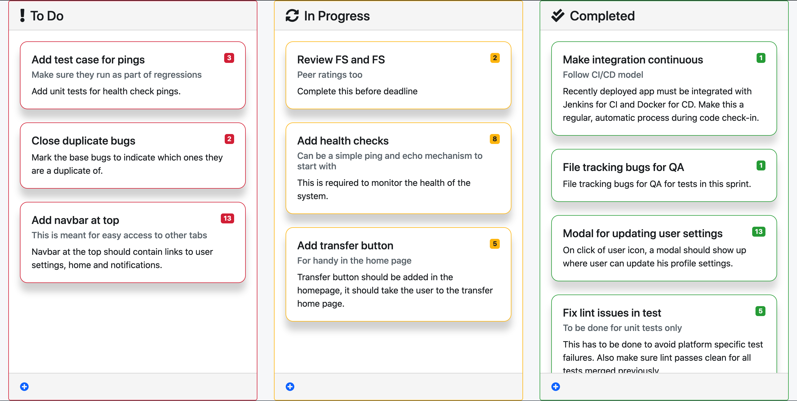
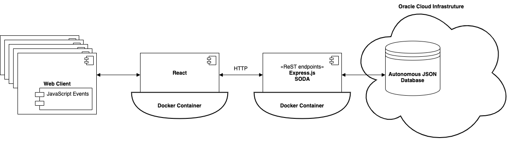

# Introduction
MuSprint is a web application designed to track sprint user stories on a story board. Stories are organized into 'To Do', 'In Progress' or 'Completed' category. Each story is assigned 'story points' to indicate the amount of effort required to complete it. Using the web user interface, it is possible to switch a story from one category to another. A story can be deleted or edited too.

# Deployment View
Currently MuSprint application uses **SERN** stack. SERN stands for **SODA-Express-React-Node.js**. Simple Oracle Document Access (aka SODA) is a set of NoSQL style APIs to create and manage JSON document collections in Oracle Database. The application runs against Autonomous JSON Database (AJD) instance.

For more info: [SODA](https://docs.oracle.com/en/database/oracle/simple-oracle-document-access/index.html) -  [Express](https://expressjs.com/) - [React](https://reactjs.org/) - [Node.js](https://nodejs.org/)

# References

* [Autonomous JSON Database (AJD)](https://www.oracle.com/autonomous-database/autonomous-json-database/)  

* [Oracle JSON Document Database](https://www.oracle.com/database/technologies/appdev/json.html)

* [SODA API](https://docs.oracle.com/en/database/oracle/simple-oracle-document-access/nodejs/index.html)

* [SQL/JSON](https://docs.oracle.com/en/database/oracle/oracle-database/19/adjsn/index.html)

# Installation Prerequisites

* [Create Oracle Cloud account](https://www.oracle.com/cloud/free)  

* [Create Autonmous JSON Database instance](https://www.oracle.com/autonomous-database/autonomous-json-database/get-started/)  

* [Download Wallet](https://docs.oracle.com/en/cloud/paas/autonomous-data-warehouse-cloud/user/connect-download-wallet.html)
  * [Blog](https://blogs.oracle.com/opal/how-connect-to-oracle-autonomous-cloud-databases)

# Deployment Instructions

Follow the instructions below to download and deploy the application, either using docker containers or manually. Steps 1 and 2 are the same for both.

### 1 Update Profile Configuration File  

After the wallet is downloaded, edit `sqlnet.ora` and change the wallet location directory to the directory containing the `cwallet.sso` file:
~~~~
WALLET_LOCATION = (SOURCE = (METHOD = file) (METHOD_DATA = (DIRECTORY="/Users/sriksure/cloud/Wallet_MuSprintDB")))
SSL_SERVER_DN_MATCH=yes
~~~~

### 2 Download Source

* Download [MuSprint](.) project source, or
* Clone git repository:
  ~~~~
  $ git clone https://github.com/oracle/json-in-db.git
  ~~~~

## Docker Deployment  

### 3 Build and Run Docker Image

This involves deployment of a frontend server (React) and a backend server (Express + SODA).The following instructions are for building all the services required for MuSprint, using `docker-compose` utility. Alternatively, you may deploy each of the services separately using docker (For instructions, see individual deployment instructions in each of the modules).

**Note:** Make sure you have [docker-compose](https://docs.docker.com/compose/compose-file/) installed. 
~~~~
$ docker-compose -v
docker-compose version 1.27.4, build 40524192
~~~~

#### 3.1 Set environment variables
As the first step, set the following environment variables in your shell session.
~~~~
export MUSPRINT_DB_USERNAME=<your_database_username>
export MUSPRINT_DB_PASSWORD=<your_database_password>
export MUSPRINT_DB_CONNSTR=<your_database_service_name>
export MUSPRINT_DB_TNS_ADMIN=<your_path_to_wallet>
export MUSPRINT_STORIES_SERVICE_URL=<your_stories_service_url>
~~~~
The application runtime requires certain environment variables in order to function properly. Below is a table with information about all variables.
| Environment Variable | Required | Description |
|-|-|-|
| MUSPRINT_DB_USERNAME | Yes | Database user you want to use. `ADMIN` is user default when you create an AJD instance. |
| MUSPRINT_DB_PASSWORD | Yes | Password for the database user. |
| MUSPRINT_DB_CONNSTR | Yes | One of the network service name entries in tnsnames.ora file in your wallet directory. The first entry would be like the following. In this example, **`musprintdb_high`** is the service name:  `musprintdb_high = (description= (retry_count=20)(retry_delay=3)(address=(protocol=tcps)(port=1522)(host=adb.us-sanjose-1.oraclecloud.com))(connect_data=(service_name=b4fzgvhdqfdosn8_musprintdb_high.adb.oraclecloud.com))(security=(ssl_server_cert_dn="CN=adb.us-sanjose-1.oraclecloud.com,OU=Oracle ADB SANJOSE,O=Oracle Corporation,L=Redwood City,ST=California,C=US")))` |
| MUSPRINT_DB_TNS_ADMIN | Yes | Absolute path of your wallet directory as specified in `sqlnet.ora`. The same path will be used inside the docker container too. |
| MUSPRINT_STORIES_SERVICE_URL | No | REST Endpoint URL for stories service. It can be the one used locally (Ex. `http://localhost:5000/stories/`) or on a public machine as well (Ex. `http://<public_ip_address>:5000/stories/`). |

#### 3.2 Build and start containers
Use `docker-compose` utility to build and start the container
~~~~
$ cd MuSprint/
$ docker-compose up
~~~~

This will start the backend stories server in port 5000 and frontend client server in port 3000.

The application is ready to view on a browser:  http://localhost:3000/

## Manual Deployment  

### 3 Install Oracle Instant Client and Node.js packages

MuSprint front and back end servers depend on Oracle Instant Client package Node.js modules. Follow the instructions below to install them.

  * Oracle Instant Client  
    https://www.oracle.com/database/technologies/instant-client/downloads.html  
    Oracle Instant Client Basic package should be enough for MuSprint. Additionally, you may also install SQL*Plus package to connect to an Oracle Database Instance.
  * Node.js  
    https://nodejs.org/en/download/

Verify Node.js and NPM packages are installed correctly.
~~~~
$ node -v
v15.0.1

$ npm -v
7.0.3
~~~~

### 4 Install Node.js Dependencies

You can see a `package.json` file in both `client/` and `stories/` directories. Using NPM, install the dependent node modules for client and stories.  

**Console - 1**
~~~~
$ cd <>/json-in-db/MuSprint/stories
$ npm install
~~~~

**Console - 2**
~~~~
$ cd <>/json-in-db/MuSprint/client
$ npm install
~~~~

### 5 Run frontend and backend servers

In two parallel consoles, run the backend and frontend servers. Alternatively, you may use [`concurrently`](https://www.npmjs.com/package/concurrently) NPM package to run the two concurrently.

#### 5.1 Run backend server [Console - 1]

Backend server uses Express.js and serves as ReST endpoints. It establishes connection to Oracle Database instance to read and write JSON documents using SODA APIs.

* Set up server environment variables
  ~~~~
  export NODE_ORACLEDB_USER=<your_database_username>
  export NODE_ORACLEDB_PASSWORD=<your_database_password>
  export NODE_ORACLEDB_CONNECTIONSTRING=<your_service_name>
  export TNS_ADMIN=<your_path_to_wallet>
  export NODE_ORACLEDB_ICPATH=<your_path_to_instant_client>
  ~~~~

  The application runtime requires certain environment variables in order to function properly. Below is a table with information about all variables.
  | Environment Variable | Required | Description |
  |-|-|-|
  | NODE_ORACLEDB_USER | Yes | Database user you want to use. `ADMIN` is default username when you create an AJD instance. |
  | NODE_ORACLEDB_PASSWORD | Yes | Password for the database user. |
  | NODE_ORACLEDB_CONNECTIONSTRING | Yes | One of the network service name entries in tnsnames.ora file in your wallet directory. The first entry would be like the following. In this example, **`musprintdb_high`** is the service name:  `musprintdb_high = (description= (retry_count=20)(retry_delay=3)(address=(protocol=tcps)(port=1522)(host=adb.us-sanjose-1.oraclecloud.com))(connect_data=(service_name=b4fzgvhdqfdosn8_musprintdb_high.adb.oraclecloud.com))(security=(ssl_server_cert_dn="CN=adb.us-sanjose-1.oraclecloud.com,OU=Oracle ADB SANJOSE,O=Oracle Corporation,L=Redwood City,ST=California,C=US")))` |
  | TNS_ADMIN | Yes | Absolute path of your wallet directory as specified in `sqlnet.ora`. The same path will be used inside the docker container too. |
  | NODE_ORACLEDB_ICPATH | Yes |  Absolute path of your instant client directory. Needed only for MacOS users. |

* Start server  
  This steps starts the ReST listener and establishes connection with Oracle Database Instance.

  ~~~~
  $ npm start
  ~~~~

  If everything goes fine, you should see the following logs in the console:
  ~~~~
  > musprint@1.0.0 start
  > node router/controller.js

  > Database connection pool initialized.
  > Stories collection created.
  > Pinging the database server...
  > Database service reachable.
  > MuSprint stories service listening at http://localhost:5000/stories/
  ~~~~

#### 5.2 Run frontend server [Console - 2]

Frontend server uses React.

* Start server  
  ~~~~
  $ npm start
  ~~~~

  If everything goes fine, you should see the following logs in the server:
  ~~~~
  > musprint@1.0.0 start
  > react-scripts start

  Starting the development server...

  Compiled successfully!

  You can now view musprint in the browser.

    Local:            http://localhost:3000
    On Your Network:  http://10.0.0.172:3000

  Note that the development build is not optimized.
  To create a production build, use npm run build.
  ~~~~
  Note:  
  * If you wish to deploy the backend server (Step 3.1) on a machinie that you would like to access using its IP address, set the environment variable **`REACT_APP_MUSTORIES_SERVICE_URL`** while running the client app. For example:
    ~~~~
    export REACT_APP_MUSTORIES_SERVICE_URL=http://<your_ip_address>:5000/stories/
    ~~~~

The application is ready to view on a browser:  http://localhost:3000/