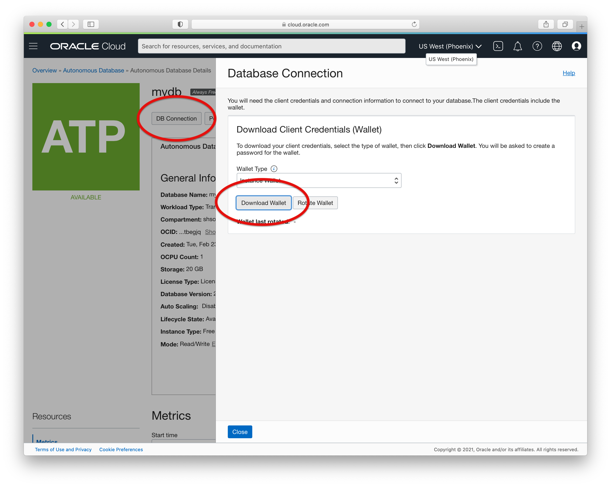

# Autonomous Database JSON from a Java Program

This directory contains examples of how to store and access JSON
collections from a Java program using SODA (Simple Oracle Document
Access).

  * [emp.CreateCollection](src/main/java/emp/CreateCollection.java) - Creates the employee collection `employees` used by all the examples.
  * [emp.Insert](src/main/java/emp/Insert.java) - Inserts three JSON values into the `employees` collection.
  * [emp.GetAll](src/main/java/emp/GetAll.java) - Gets all the JSON values from the `employees` collection.
  * [emp.Filter](src/main/java/emp/Filter.java) - Selects employees from the `employees` collection where the salary attribute is greater than 30,000.
  * [emp.Filter2](src/main/java/emp/Filter2.java) - Selects employees from the `employees` collection that have the `created` attribute.
  * [emp.Update](src/main/java/emp/Update.java) - Updates an employee document using whole document replacement.
  * [emp.UpdateMerge](src/main/java/emp/UpdateMerge.java) - Performs a partial update using JSON mergepatch.
  * [emp.JSONP](src/main/java/emp/JSONP.java) - Inserts and retrieves a value using [JSON-P (javax.json)](https://javaee.github.io/jsonp/) interfaces.
  * [emp.JSONB](src/main/java/emp/JSONB.java) - Stores and retrieves a plain/custom Java object as JSON using [JSON-B (javax.json.bind)](https://javaee.github.io/jsonb-spec/).
  * [emp.Jackson](src/main/java/emp/Jackson.java) - Encodes JSON from an external source, in this case a Jackson parser, as Oracle binary JSON and inserts it into the table.
  * [emp.RunAll](src/main/java/emp/RunAll.java) - Runs all the examples at once.
  * [emp.DropCollection](src/main/java/emp/DropCollection.java) - Drops the collection used by the examples.

See also:

  * Documentation:
    - [SODA for Java (oracle.soda)](http://oracle.github.io/soda-for-java/)
    - [The API for JSON type in Oracle Database (oracle.sql.json)](http://oracle.github.io/soda-for-java/https://docs.oracle.com/en/database/oracle/oracle-database/21/jajdb/oracle/sql/json/package-summary.html)
  * Video:
    - [Finally: A Low-Latency, Scalable JSON Document Store with Real-Time Analytics] (https://youtu.be/sQUUCwVEU9o)
    - [AskTom Office Hours: The Java API for JSON type in Oracle JDBC](https://youtu.be/jg5d15-2K3Y)

## Running the examples

### Create a database

These steps show how to create an always-free Autonomous Database but any 21c or later version of Oracle Database will also work.

1. Create a free cloud account:<br/>
   [https://www.oracle.com/cloud/free/](https://www.oracle.com/cloud/free/). 
   
   _It will ask for a credit card for identification purposes.  Your card will not be charged unless you manually choose to upgrade out of the free-tier limits._
   
2. Sign-in to the cloud console and click on **Autonomous Transaction Processing** under the drop-down menu. <br/>
    

3. Click **Create Autonomous Database**.  When creating the database, ensure that
    - Workload type **Transaction Processing** or **JSON** is selected
    - **Always Free** is selected
    - Version **21c** (or later) is selected
  
    

4. Once the database is created, click on **DB Connection** and download the database wallet. The database wallet enables encrypted access and provides the connection details.  Remember the wallet password you enter as you will needed it in **Step 6**.
   
    
  
5. Unzip the wallet.  The remaining examples assume the wallet is unziped to the directory `/Users/test/Wallet_mydb`

6. **IMPORTANT**: Modify `ojdbc.properties` in the wallet directory.

    - Comment out the line that begins `oracle.net.wallet_location=...`:
    ```
    # Connection property for Oracle Wallets 
    # oracle.net.wallet_location=(SOURCE=(METHOD=FILE)(METHOD_DATA=(DIRECTORY=${TNS_ADMIN}))
    ```
    - Uncomment the lines starting ``javax.net...`` and set `trustStorePassword` and `keyStorePassword` to the password you entered in **Step 4**:
    ```
    javax.net.ssl.trustStore=${TNS_ADMIN}/truststore.jks 
    javax.net.ssl.trustStorePassword=welcome1
    javax.net.ssl.keyStore=${TNS_ADMIN}/keystore.jks 
    javax.net.ssl.keyStorePassword=welcome1
    ```
      
    For details on wallets and connection strings, see: [https://www.oracle.com/database/technologies/java-connectivity-to-atp.html](https://www.oracle.com/database/technologies/java-connectivity-to-atp.html)

### Setup the examples

1. Clone these examples from github.  For example:
    ```
    git clone https://github.com/oracle/json-in-db.git
    cd json-in-db/SodaExamples/
    ```
    If you don't have `git` you can alternatively download them here:
    [https://github.com/oracle/json-in-db/archive/master.zip](https://github.com/oracle/json-in-db/archive/master.zip)
   
2. Install [Java](https://www.oracle.com/java/technologies/javase-downloads.html#JDK8) and [Maven](https://maven.apache.org/install.html)

3. Build the examples:

    ```
    mvn package
    ``` 

### Run the examples


1. Run all the examples:

    ```
     mvn -q exec:java \
      -Dexec.mainClass="emp.RunAll" \
      -Dexec.args='jdbc:oracle:thin:ADMIN/mypassword@mydb_tp?TNS_ADMIN=/Users/test/Wallet_mydb'
    ```
    But replace the following values with your own:
    - Replace ``mypassword`` with the ``ADMIN`` password you specified when you created the database
    - Replace `/Users/test/Wallet_mydb` with the actual path to your wallet (see above) 
    - Replace `mydb_tp` with `[dbname]_tp` where dbname is the name of your database.  This is the name you chose when you created the database.  You can find the name in your wallet file `tnsnames.ora` if you have forgotten it.

2. Drop the collection used by the examples:

    ```
     mvn -q exec:java \
      -Dexec.mainClass="emp.DropCollection" \
      -Dexec.args='jdbc:oracle:thin:ADMIN/mypassword@mydb_tp?TNS_ADMIN=/Users/test/Wallet_mydb'
    ```

3. You can also run specific examples, one at a time:

    ```
     mvn -q exec:java \
      -Dexec.mainClass="emp.CreateCollection" \
      -Dexec.args='jdbc:oracle:thin:ADMIN/mypassword@mydb_tp?TNS_ADMIN=/Users/test/Wallet_mydb'
    ```

## Using JSON Workshop

You can access the collections created in these examples using JSON Workshop.

1. Login to the database console and click on "DB Actions":

    

2. Enter the database username (for example, ADMIN)

    

3. Click on "JSON" to open JSON workshop.

    

4. Use JSON Workshop to view, query, and modify the `employees` collection:

    
