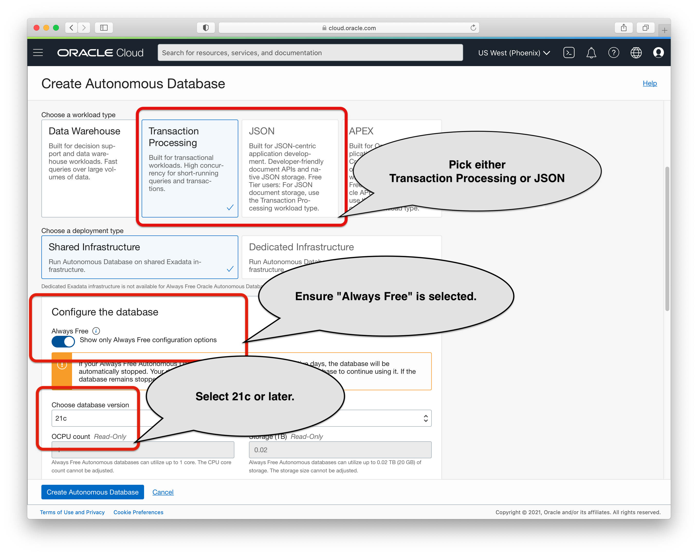
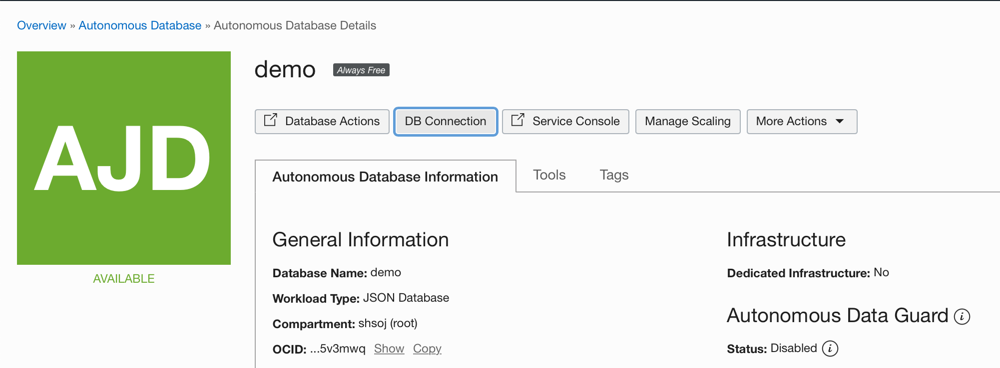
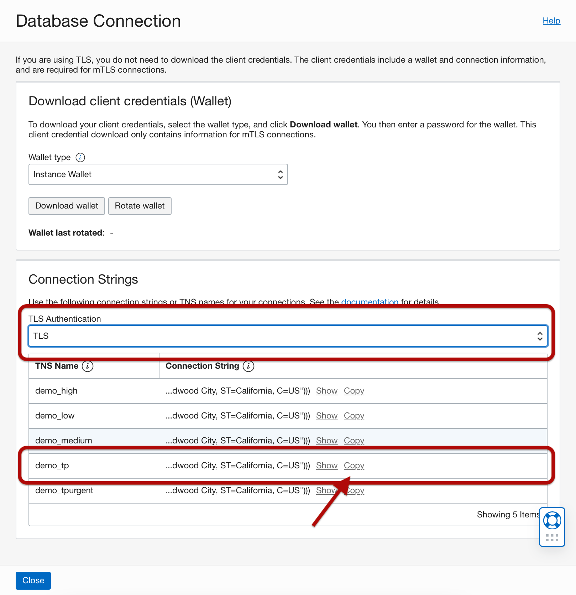
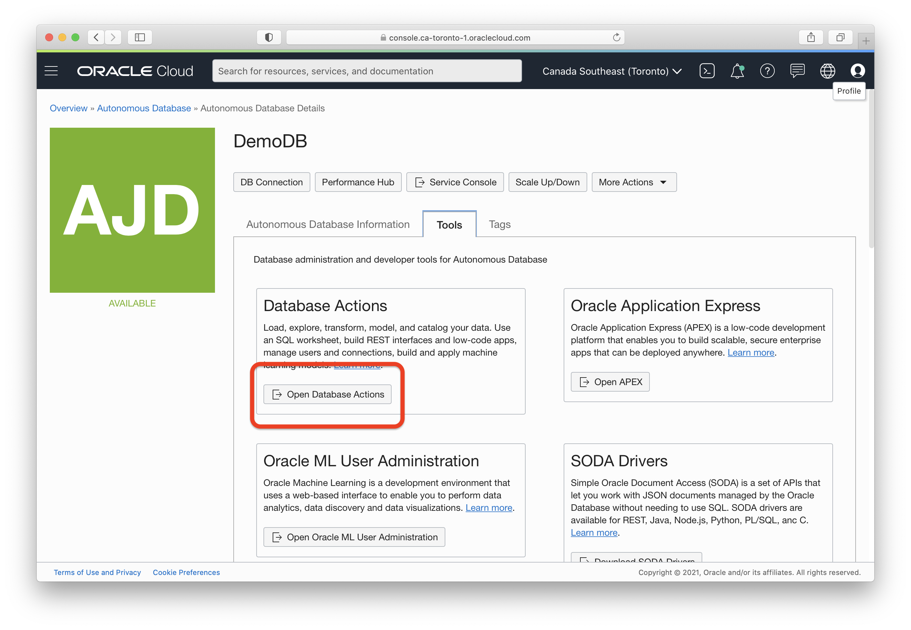
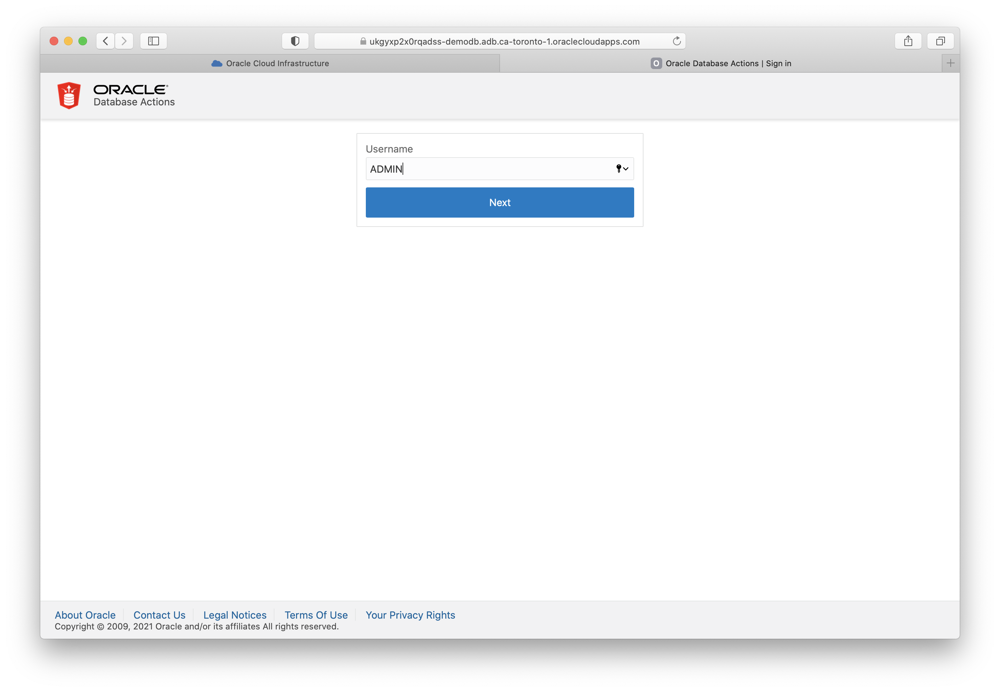
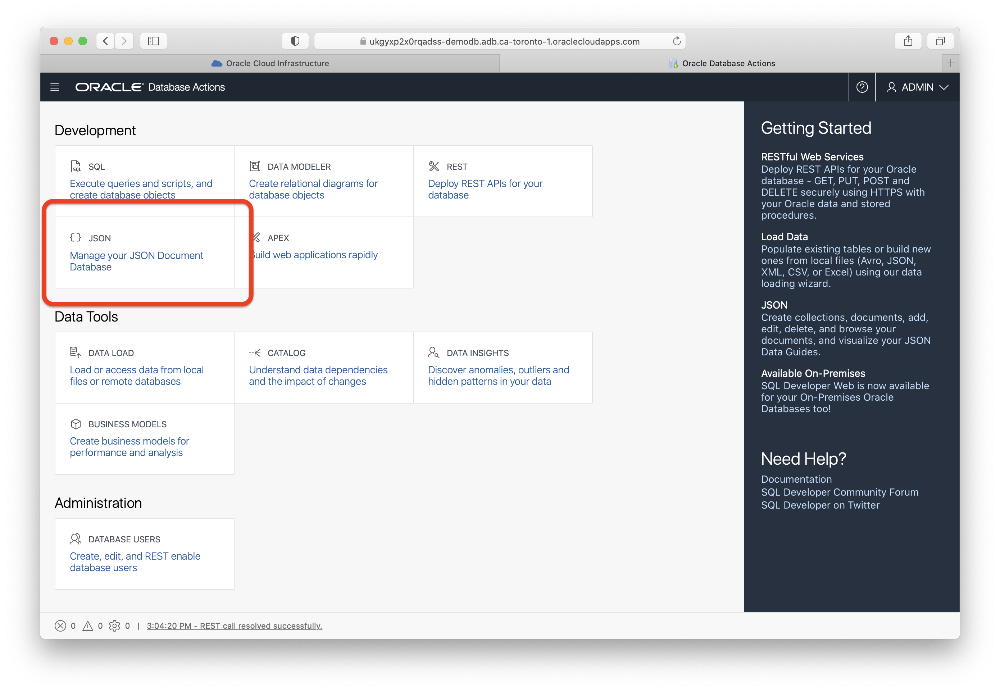
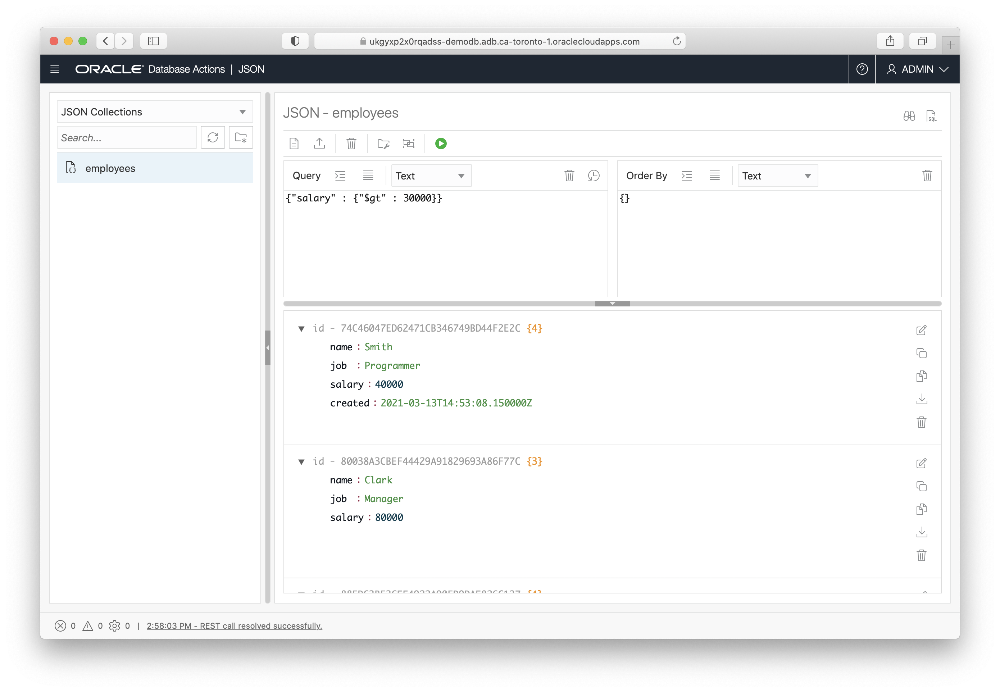

# Autonomous Database JSON from Java

This directory contains examples of how to store and access JSON
collections from a Java program using SODA (Simple Oracle Document
Access).

  * [emp.CreateCollection](src/main/java/emp/CreateCollection.java) - Creates the employee collection `employees` used by all the examples.
  * [emp.Insert](src/main/java/emp/Insert.java) - Inserts three JSON values into the `employees` collection.
  * [emp.GetAll](src/main/java/emp/GetAll.java) - Gets all the JSON values from the `employees` collection.
  * [emp.Filter](src/main/java/emp/Filter.java) - Selects employees from the `employees` collection where the salary attribute is greater than 30,000.
  * [emp.Filter2](src/main/java/emp/Filter2.java) - Selects employees from the `employees` collection that have the `created` attribute.
  * [emp.Update](src/main/java/emp/Update.java) - Updates an employee document using whole document replacement.
  * [emp.UpdateMerge](src/main/java/emp/UpdateMerge.java) - Performs a partial update using JSON mergepatch.
  * [emp.JSONP](src/main/java/emp/JSONP.java) - Inserts and retrieves a value using [JSON-P (javax.json)](https://javaee.github.io/jsonp/) interfaces.
  * [emp.JSONB](src/main/java/emp/JSONB.java) - Stores and retrieves a plain/custom Java object as JSON using [JSON-B (javax.json.bind)](https://javaee.github.io/jsonb-spec/).
  * [emp.Jackson](src/main/java/emp/Jackson.java) - Encodes JSON from an external source, in this case a Jackson parser, as Oracle binary JSON and inserts it into the table.
  * [emp.AddPhoneNumbers](src/main/java/emp/AddPhoneNumbers.java) - Adds an array of phone numbers to each employee.
  * [emp.GetPhoneNumbers](src/main/java/emp/GetPhoneNumbers.java) - Shows how to read values in a nested array.
  * [emp.RunAll](src/main/java/emp/RunAll.java) - Runs all the examples at once.
  * [emp.DropCollection](src/main/java/emp/DropCollection.java) - Drops the collection used by the examples.

See also:

  * Documentation:
    - [SODA for Java (oracle.soda)](http://oracle.github.io/soda-for-java/)
    - [The API for JSON type in Oracle Database (oracle.sql.json)](http://oracle.github.io/soda-for-java/https://docs.oracle.com/en/database/oracle/oracle-database/21/jajdb/oracle/sql/json/package-summary.html)
  * Video: [Finally: A Low-Latency, Scalable JSON Document Store with Real-Time Analytics](https://youtu.be/sQUUCwVEU9o)
  * Microservice Example: [MuShop - shopping cart service](https://github.com/oracle-quickstart/oci-cloudnative/tree/master/src/carts)

Need help?
  * Talk to us on Slack: [#oracle-db-json](https://oracledevrel.slack.com/#oracle-db-json)

## Running the examples

### Create a database

These steps show how to create an always-free Autonomous Database but any 21c or later version of Oracle Database will also work.

1. Create a free cloud account:<br/>
   [https://www.oracle.com/cloud/free/](https://www.oracle.com/cloud/free/). 
   
   _It will ask for a credit card for identification purposes.  Your card will not be charged unless you manually choose to upgrade out of the free-tier limits._
   
2. Sign-in to the cloud console and click on **Autonomous Transaction Processing** under the drop-down menu. <br/>
    

3. Click **Create Autonomous Database**.  When creating the database, ensure that
    - Workload type **Transaction Processing** or **JSON** is selected
    - **Always Free** is selected
    - Version **21c** (or later) is selected
  
    
    
    - Select "Secure access from allowed IPs and VCNs only" and add your current IP address. This makes it so access is only allowed from your current IP address.  It also makes it so that Mutual TLS encryption is not required (you don't have to download the database wallet). 
    

4. Once the database is created, click on **DB Connection**

    <kbd></kbd>

   Select TLS and copy the connection string by clicking "Copy".  Use "tp" for transactional or operational workloads.

    <kbd></kbd>
  

### Setup the examples

1. Clone these examples from github.  For example:
    ```
    git clone https://github.com/oracle/json-in-db.git
    cd json-in-db/SodaExamples/
    ```
    If you don't have `git` you can alternatively download them here:
    [https://github.com/oracle/json-in-db/archive/master.zip](https://github.com/oracle/json-in-db/archive/master.zip)
   
2. Install [Java](https://www.oracle.com/java/technologies/javase-downloads.html#JDK8) and [Maven](https://maven.apache.org/install.html)

3. Build the examples:

    ```
    mvn package
    ``` 

### Run the examples


1. Run all the examples:

    ```
     mvn -q exec:java \
      -Dexec.mainClass="emp.RunAll" \
      -Dexec.args='jdbc:oracle:thin:ADMIN/[PASSWORD]@[CONNECTION STRING]'
    ```
    But replace the following values with your own:
    - Replace [PASSWORD] with the ``ADMIN`` password you specified when you created the database
    - Replace [CONNECTION STRING] with the string you copied above in step 4.

    The actual command might look something like this:

    ```
     mvn -q exec:java \
      -Dexec.mainClass="emp.RunAll" \
      -Dexec.args='jdbc:oracle:thin:ADMIN/SecurePassword123!@(description=(retry_count=20)(retry_delay=3)(address=(protocol=tcps)(port=1521)(host=adb.us-ashburn-1.oraclecloud.com))(connect_data=(service_name=tx8s4whxjz2u232_demo_tp.adb.oraclecloud.com))(security=(ssl_server_dn_match=yes)(ssl_server_cert_dn="CN=adwc.uscom-east-1.oraclecloud.com, OU=Oracle BMCS US, O=Oracle Corporation, L=Redwood City, ST=California, C=US")))'


2. Drop the collection used by the examples:

    ```
     mvn -q exec:java \
      -Dexec.mainClass="emp.DropCollection" \
      -Dexec.args='jdbc:oracle:thin:ADMIN/SecurePassword123!@(description=(retry_count=20)(retry_delay=3)(address=(protocol=tcps)(port=1521)(host=adb.us-ashburn-1.oraclecloud.com))(connect_data=(service_name=tx8s4whxjz2u232_demo_tp.adb.oraclecloud.com))(security=(ssl_server_dn_match=yes)(ssl_server_cert_dn="CN=adwc.uscom-east-1.oraclecloud.com, OU=Oracle BMCS US, O=Oracle Corporation, L=Redwood City, ST=California, C=US")))'
    ```

3. You can also run specific examples, one at a time:

    ```
     mvn -q exec:java \
      -Dexec.mainClass="emp.CreateCollection" \
      -Dexec.args='jdbc:oracle:thin:ADMIN/SecurePassword123!@(description=(retry_count=20)(retry_delay=3)(address=(protocol=tcps)(port=1521)(host=adb.us-ashburn-1.oraclecloud.com))(connect_data=(service_name=tx8s4whxjz2u232_demo_tp.adb.oraclecloud.com))(security=(ssl_server_dn_match=yes)(ssl_server_cert_dn="CN=adwc.uscom-east-1.oraclecloud.com, OU=Oracle BMCS US, O=Oracle Corporation, L=Redwood City, ST=California, C=US")))'
    ```

## Using JSON Workshop

You can access the collections created in these examples using JSON Workshop.

1. Login to the database console and click on "DB Actions":

    

2. Enter the database username (for example, ADMIN)

    

3. Click on "JSON" to open JSON workshop.

    

4. Use JSON Workshop to view, query, and modify the `employees` collection:

    
