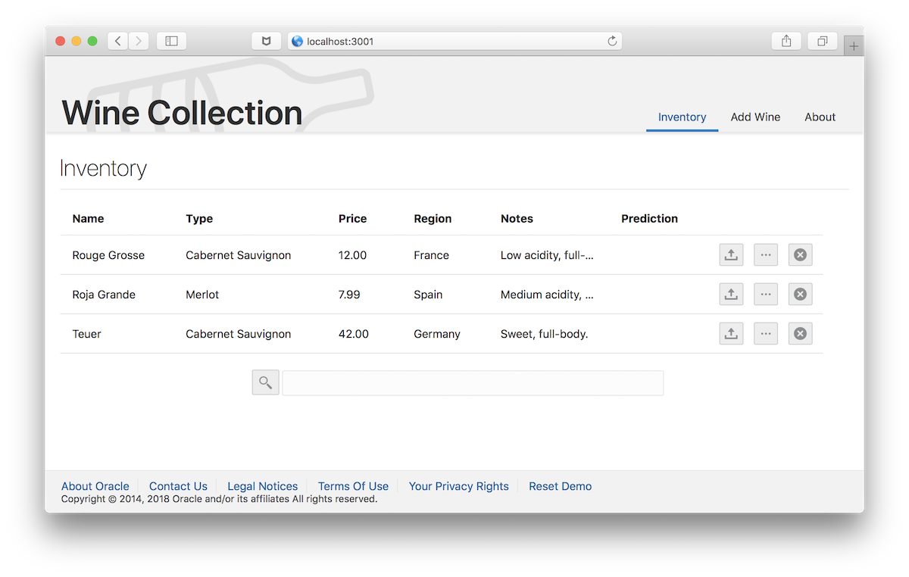

# Introduction

This example Node.js application manages a wine collection.  The
application uses simple CRUD (create, read, update, and delete)
operations over a collection of JSON documents stored in Oracle
Database (see [db/wines-oracle.js](db/wines-oracle.js)).  The application code does not use SQL but
SQL can still be used over the data for reporting and analytics when
needed (see [sql/examples.sql](sql/examples.sql)).  This development model gives the
flexibility and ease-of-use common to NoSQL document stores without
losing the ability to leverage SQL directly over operational data.

# References

* SODA API  
  [https://docs.oracle.com/en/database/oracle/simple-oracle-document-access/nodejs/index.html]()

* SQL/JSON  
  [https://docs.oracle.com/en/database/oracle/oracle-database/19/adjsn/index.html]()

# Running in Docker

* Install Docker  
  [https://www.docker.com/]()

* Build the demo image 

  ~~~~
  cd WineDemo
  docker build -t username/winedemo .  
  ~~~~

* Run the demo 

   The docker image can now be run against either an on-premise database or the autonomous database cloud (including the [always free version](https://www.oracle.com/cloud/free/)) .  

   * Option 1: Autonomous Database
   
      * Download the [database wallet](https://docs.oracle.com/en/cloud/paas/autonomous-data-warehouse-cloud/user/connect-download-wallet.html#GUID-B06202D2-0597-41AA-9481-3B174F75D4B1)

      * Unzip the wallet and edit sqlnet.ora so that `DIRECTORY` is set
        to `"/wallet"` 

      * Run the following:  
      
          ~~~~
          docker run -it \
             --env NODE_ORACLEDB_USER=ADMIN \
             --env NODE_ORACLEDB_PASSWORD=[PASSWORD] \
             --env NODE_ORACLEDB_CONNECTIONSTRING=[SERVICE] \
             --env TNS_ADMIN=/wallet \
             --volume /local/path/to/wallet:/wallet \
             -p 3000:3000 \
             username/winedemo 
          ~~~~  

        Where PASSWORD is your password and SERVICE is an entry in
        tnsnames.ora (e.g. mydb_high).  Replace `/local/path/to/wallet` with the correct path to the unziped wallet.

   * Option 2: On-premise database
     
      * Run the following:  
      
          ~~~~
          docker run -it \
             --env NODE_ORACLEDB_USER=[USER] \
             --env NODE_ORACLEDB_PASSWORD=[PASSWORD] \
             --env NODE_ORACLEDB_CONNECTIONSTRING=[HOST]:[PORT]/[SERVICENAME] \
             -p 3000:3000 \
             username/winedemo
          ~~~~  

        Replacing USER, PASSWORD, HOST, PORT, and SERVICENAME with the
        correct values. Replace `/local/path/to/wallet` with the correct path to the unziped wallet.

   * Open demo app:   
     [http://localhost:3000]()
   
# Manual Installation 

* Get Node.js.  For example:

  ~~~~
  wget "https://nodejs.org/dist/v10.16.3/node-v10.16.3-linux-x64.tar.xz"
  tar -xvf node-v10.16.3-linux-x64.tar.xz
  setenv PATH "/scratch/local/jsondb/node-v10.16.3-linux-x64/bin:$PATH"
  ~~~~

* Install JET  

  ~~~~
  npm -g install @oracle/ojet-cli`
  ~~~~

* From the `WineDemo` directory, run

  ~~~~
  npm install
  ~~~~

* Install the Oracle Instant Client library.  
  [https://github.com/oracle/node-oracledb/blob/master/INSTALL.md]()

* Set database connection information

  ~~~~
  export NODE_ORACLEDB_USER=scott
  export NODE_ORACLEDB_PASSWORD=tiger
  export NODE_ORACLEDB_CONNECTIONSTRING=localhost:1521/orcl
  ~~~~

* Build JET sources

  ~~~~
  ojet build
  ~~~~

* Start node.js

  ~~~~
  node server.js
  ~~~~

* Open demo app  
  [http://localhost:3000]()
